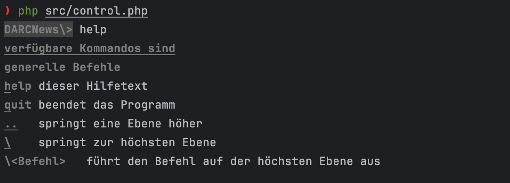

# Newsrouter:

Dies ist eine PHP Applikation mit dem Ziel, Events/Nachrichten oder Einträge aus verschiedenen Quellen zu sammeln zwischenzuspeichern und über verschiedene Kanäle auszuspielen.

Dabei kann für jede Quelle unter [Source](src/Source) eine eigene Klasse erstellt werden, die die Daten aus der Quelle abholt und in die Datenbank speichert.

Es stehen zur Nutzung von platformspezifischer Features verschiedene [Formatter](src/Formatter) zur Verfügung.

Weiterhin ist die Verwendung von [Filtern](src/Filter) möglich.

Die einzelnen Ausgabekanäle sind in [Channels](src/Channel) zu finden.

Das Datenbankschema ist in [doc](doc) zu finden.

Die CLI ist mit `php control.php` erreichbar.

`help` zeigt eine Übersicht der verfügbaren Befehle.

## Installation

Eine Datenbank unter localhost zu Entwicklungs- und Testzwecken sollte `darcnews` heißen und mit dem Login `darcnews:darcnews` erreichbar sein.

Benötigte PHP-Module:
* php-xml
* php-mbstring
* php-pgsql

Empfohlene PHP Version: 8.2